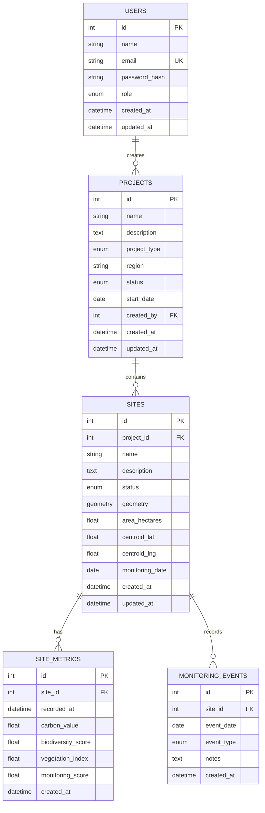

# Darukaa.Earth 🌍
### Geospatial Carbon & Biodiversity Project Intelligence Platform

A production-quality full-stack geospatial analytics platform for managing and visualizing carbon and biodiversity conservation projects. Built as an internship coding challenge demonstrating enterprise-grade architecture, geospatial data handling, and analytics visualization.

> ⚠️ **Demo Notice**: All analytics data (carbon values, biodiversity scores, etc.) uses synthetic datasets for demonstration purposes. Values do not represent actual environmental measurements.

---

## 🚀 Live Demo

- **Frontend**: _Deploy to Vercel using instructions below_
- **Backend API**: _Deploy to Render using instructions below_
- **API Docs**: `{backend_url}/docs` (FastAPI Swagger UI)

**Demo Credentials** (populated by seed script):
```
Admin:  admin@darukaa.earth  /  DemoAdmin2024!
User:   user@darukaa.earth   /  DemoUser2024!
```

---

## 🏗️ Architecture

```
┌─────────────────────────────────────┐
│         React + TypeScript          │
│  Vite · Mapbox GL JS · Chart.js     │
│  React Router · Axios · Tailwind    │
│         (Vercel deployment)         │
└────────────────┬────────────────────┘
                 │ HTTPS REST API
                 ▼
┌─────────────────────────────────────┐
│           FastAPI (Python)          │
│  JWT Auth · SQLAlchemy · GeoAlchemy │
│  Pydantic · Alembic · Uvicorn       │
│         (Render deployment)         │
└────────────────┬────────────────────┘
                 │ SQLAlchemy ORM
                 ▼
┌─────────────────────────────────────┐
│      PostgreSQL + PostGIS 3.4       │
│  POLYGON geometry · GIST indexes    │
│  ST_Area · ST_Centroid · ST_AsGeoJSON│
│    (Managed PostgreSQL + PostGIS)   │
└─────────────────────────────────────┘

            GitHub Actions
                  │
         ┌────────┴────────┐
         ▼                 ▼
   Lint + Test         Build + Deploy
   (on PR/push)       (on main push)
```

---

## ✨ Key Features

| Feature | Implementation |
|---|---|
| **User Authentication** | JWT (HS256) + bcrypt password hashing |
| **Project Management** | Full CRUD with pagination, search, filters |
| **Polygon Drawing** | Mapbox GL Draw → GeoJSON → PostGIS POLYGON |
| **Geospatial Storage** | PostGIS geometry with GIST spatial index |
| **Area Calculation** | `ST_Area(geom::geography)/10000` (geodetic hectares) |
| **Map Visualization** | Mapbox GL JS with color-coded polygon layers |
| **Analytics Charts** | Chart.js time-series (carbon, biodiversity, NDVI) |
| **Dashboard KPIs** | Live database aggregations via FastAPI |
| **Code Quality** | Husky + lint-staged + ESLint + Prettier + Ruff |
| **CI/CD** | GitHub Actions (lint + test + build + deploy) |

---

## 📁 Repository Structure

```
darukaa-earth/
├── frontend/                    # React + Vite + TypeScript
│   ├── src/
│   │   ├── components/
│   │   │   └── layout/         # AppLayout (sidebar)
│   │   ├── context/
│   │   │   └── AuthContext.tsx  # JWT auth state
│   │   ├── pages/              # All application pages
│   │   ├── router/             # React Router (protected routes)
│   │   ├── services/           # Typed API clients (Axios)
│   │   ├── test/               # Vitest tests
│   │   ├── types/              # TypeScript interfaces
│   │   └── utils/              # Formatting helpers
│   ├── .prettierrc
│   ├── eslint.config.js
│   └── vitest.config.ts
│
├── backend/                     # Python FastAPI
│   ├── app/
│   │   ├── api/v1/
│   │   │   ├── endpoints/      # Route handlers (thin)
│   │   │   └── router.py       # API router aggregation
│   │   ├── core/
│   │   │   ├── config.py       # Pydantic Settings
│   │   │   └── security.py     # JWT + bcrypt
│   │   ├── db/
│   │   │   └── database.py     # SQLAlchemy session
│   │   ├── models/             # ORM models
│   │   ├── schemas/            # Pydantic schemas
│   │   ├── services/           # Business logic layer
│   │   └── main.py             # FastAPI app factory
│   ├── alembic/                # Database migrations
│   ├── tests/                  # Pytest tests
│   ├── seed.py                 # Database seeder
│   ├── requirements.txt
│   ├── pyproject.toml          # Ruff configuration
│   └── Dockerfile
│
├── .github/
│   └── workflows/
│       ├── ci.yml              # Lint + test (PRs + main)
│       └── deploy.yml          # Deploy (main only)
├── .husky/
│   └── pre-commit              # lint-staged runner
├── docker-compose.yml
├── .env.example
└── README.md
```

---

## 🗄️ Database Schema



### Schema Decisions

- **`geometry` column**: Uses PostGIS `POLYGON` type in EPSG:4326 (WGS84) for direct GeoJSON interoperability with Mapbox.
- **`area_hectares`**: Pre-computed on site creation using `ST_Area(geom::geography)/10000`. Casting to `geography` type performs accurate geodetic measurement on the ellipsoid rather than treating degrees as linear units.
- **`centroid_lat/lng`**: Pre-computed via `ST_Centroid` for fast map centering without repeated spatial queries.
- **Spatial GIST index** on `sites.geometry` for efficient spatial queries.
- **Cascade deletes**: Sites cascade-delete when a project is deleted; metrics cascade-delete when a site is deleted.

---

## 🔐 Authentication Architecture

```
Client                FastAPI                 Database
  │                      │                       │
  │ POST /api/auth/login  │                       │
  │─────────────────────>│                       │
  │                      │ SELECT user by email  │
  │                      │──────────────────────>│
  │                      │<──────────────────────│
  │                      │ bcrypt.verify(pwd)    │
  │                      │ JWT.encode({sub: id}) │
  │<─────────────────────│                       │
  │ {access_token, user} │                       │
  │                      │                       │
  │ GET /api/projects     │                       │
  │ Authorization: Bearer │                       │
  │─────────────────────>│                       │
  │                      │ JWT.decode(token)     │
  │                      │ SELECT user by id     │
  │                      │──────────────────────>│
  │<─────────────────────│                       │
  │ Project data          │                       │
```

- **Algorithm**: HS256 with 256-bit secret
- **Expiry**: 24 hours (configurable via `ACCESS_TOKEN_EXPIRE_MINUTES`)
- **Storage**: `localStorage` (frontend). Token is sent in `Authorization: Bearer` header.
- **Password hashing**: bcrypt with adaptive cost factor via `passlib`
- **Auto-redirect**: Axios response interceptor detects 401 and redirects to `/login`

---

## 🗺️ Map Implementation

### Polygon Drawing Flow

```
User clicks "Draw Polygon"
        │
        ▼
Mapbox GL Draw enters draw_polygon mode
        │
        ▼
User clicks map to place vertices
        │
        ▼
User double-clicks to close polygon
        │
        ▼
draw.create event fires → GeoJSON captured
        │
        ▼
Frontend validates geometry
(min 4 coordinate pairs, lat/lng range)
        │
        ▼
POST /api/sites  { geometry: { type: "Polygon", coordinates: [...] } }
        │
        ▼
Backend: Pydantic validates GeoJSON schema
        │
        ▼
PostGIS: ST_Area(geom::geography)/10000 → area_hectares
         ST_Centroid(geom) → centroid_lat, centroid_lng
         geometry stored as POLYGON SRID=4326
        │
        ▼
Response: Site with area, centroid, ID
        │
        ▼
Polygon appears on project map (GeoJSON layer)
```

### Area Calculation

```python
# Uses PostgreSQL geography type for geodetic accuracy
SELECT ST_Area(ST_GeomFromText(wkt, 4326)::geography) / 10000.0 AS area_ha
```

- `::geography` cast performs calculations on the WGS84 ellipsoid
- Result in square meters, divided by 10,000 for hectares
- This avoids the common error of treating degree-based measurements as metres

---

## 📊 Analytics Implementation

### Synthetic Dataset

Metrics are generated by `seed.py` using `random.seed(42)` (deterministic):

| Metric | Model | Rationale |
|---|---|---|
| `carbon_value` (tCO₂e/ha) | Upward trend + noise | Restoration sites accumulate carbon over time |
| `biodiversity_score` (0-100) | Mean-reverting + seasonal | Biodiversity fluctuates with seasons |
| `vegetation_index` (0-1) | Sinusoidal seasonal | NDVI proxy with wet/dry season variation |
| `monitoring_score` (0-100) | Gradually increasing | Programme maturity improves data completeness |

18 monthly observations per site are created during seeding.

### Dashboard KPIs

All dashboard figures are computed live from the database via `GET /api/dashboard/summary`:
- Total projects/sites: simple `COUNT` queries
- Total area: `SUM(area_hectares)`
- Average biodiversity: mean of latest metric per site (using subquery)
- Total carbon value: weighted sum × area per site

---

## 🛠️ Local Development Setup

### Prerequisites

- Docker Desktop
- Node.js 20+
- Python 3.12+
- A Mapbox account (free tier)

### Quick Start with Docker

```bash
# 1. Clone repository
git clone <your-repo-url>
cd darukaa-earth

# 2. Create environment file
cp .env.example .env
# Edit .env — add your MAPBOX token:
# VITE_MAPBOX_TOKEN=pk.your_token_here

# 3. Start database + backend
docker compose up -d

# The backend container will automatically:
# - Wait for PostgreSQL/PostGIS to be ready
# - Run: alembic upgrade head  (create all tables)
# - Run: python seed.py        (populate demo data)
# - Start uvicorn on port 8000

# 4. Start frontend (separate terminal)
cd frontend
npm install
npm run dev

# App available at: http://localhost:5173
# API Swagger UI:   http://localhost:8000/docs
```

### Manual Setup (without Docker)

```bash
# PostgreSQL with PostGIS required
# Install PostgreSQL 16 + PostGIS 3.4

# Create database
psql -U postgres -c "CREATE DATABASE darukaa_earth;"
psql -U postgres -d darukaa_earth -c "CREATE EXTENSION postgis;"

# Backend
cd backend
python -m venv venv
source venv/bin/activate        # Windows: venv\Scripts\activate
pip install -r requirements.txt

# Copy and edit .env
cp ../.env.example .env
# Edit DATABASE_URL to point to your local PostgreSQL

# Run migrations
alembic upgrade head

# Seed demo data
python seed.py

# Start backend
uvicorn app.main:app --reload --port 8000

# Frontend (new terminal)
cd frontend
npm install
npm run dev
```

---

## 🔧 Environment Variables

| Variable | Description | Required |
|---|---|---|
| `DATABASE_URL` | PostgreSQL connection string with PostGIS DB | ✅ |
| `JWT_SECRET_KEY` | Secret for JWT signing (min 32 chars) | ✅ |
| `JWT_ALGORITHM` | JWT algorithm (default: HS256) | ✅ |
| `ACCESS_TOKEN_EXPIRE_MINUTES` | Token TTL (default: 1440 = 24h) | ✅ |
| `CORS_ORIGINS` | Comma-separated allowed frontend origins | ✅ |
| `VITE_MAPBOX_TOKEN` | Mapbox public token (pk.*) | ✅ |
| `VITE_API_BASE_URL` | Backend URL (default: http://localhost:8000) | ✅ |
| `ENVIRONMENT` | `development` or `production` | Optional |

Generate a secure `JWT_SECRET_KEY`:
```bash
python -c "import secrets; print(secrets.token_hex(32))"
```

---

## 🗃️ Database Migrations

```bash
cd backend

# Apply all pending migrations
alembic upgrade head

# Create a new migration after model changes
alembic revision --autogenerate -m "describe change"

# Rollback one migration
alembic downgrade -1

# Check current migration status
alembic current
```

## 🌱 Seed Data

```bash
cd backend

# Run seed (idempotent — safe to run multiple times)
python seed.py

# This creates:
# - 2 users (admin + regular user)
# - 3 projects (Brazil, Borneo, India)
# - 9 sites with real polygon geometries
# - 162 monthly metric records (18/site)
# - 54 monitoring events (6/site)
```

---

## 🧪 Testing

### Backend Tests

```bash
cd backend

# Install dependencies
pip install -r requirements.txt

# Run all tests
pytest tests/ -v

# Run with coverage report
pytest tests/ --cov=app --cov-report=term-missing

# Run specific test file
pytest tests/test_auth.py -v
```

**Test coverage includes:**
- User registration (success, duplicate email, invalid email, short password)
- User login (success, wrong password, nonexistent user)
- JWT protection (valid token, no token, invalid token)
- Project CRUD (create, list, get, update, delete, search, validation)
- Health check endpoint

### Frontend Tests

```bash
cd frontend

# Run tests
npm test

# Run in watch mode
npm run test:watch
```

**Test coverage includes:**
- Login form rendering and validation
- Registration form with password mismatch detection
- Demo credential autofill
- Link navigation

---

## 🔍 Code Quality

### Pre-commit Hooks (Husky + lint-staged)

```bash
# Pre-commit hooks run automatically on git commit
git commit -m "your message"

# Manually trigger lint-staged
npx lint-staged

# Staged file processing:
# *.ts, *.tsx  → ESLint (fix) + Prettier (write)
# *.css, *.json, *.md → Prettier (write)
# *.py         → Ruff check (fix) + Ruff format
```

### Manual Quality Checks

```bash
# Frontend
cd frontend
npm run lint          # ESLint
npm run format        # Prettier

# Backend
cd backend
ruff check .          # Lint
ruff format .         # Format
ruff check --fix .    # Lint + autofix
```

---

## 🚀 CI/CD Pipeline (GitHub Actions)

### CI Workflow (`.github/workflows/ci.yml`)

Triggers on: push to `main`/`develop`, pull requests to `main`

```
1. Frontend Job:
   ├── Checkout code
   ├── Setup Node.js 20 (with npm cache)
   ├── npm ci
   ├── ESLint (npm run lint)
   ├── Vitest (npm test)
   └── Vite build (npm run build)

2. Backend Job:
   ├── Checkout code
   ├── Start PostGIS service container (postgis/postgis:16-3.4)
   ├── Setup Python 3.12 (with pip cache)
   ├── pip install -r requirements.txt
   ├── Ruff lint check
   ├── Ruff format check
   ├── alembic upgrade head (applies migrations)
   └── pytest tests/ (with coverage)
```

### Deploy Workflow (`.github/workflows/deploy.yml`)

Triggers on: push to `main` only

```
1. Frontend → Vercel (via Vercel CLI + VERCEL_TOKEN)
2. Backend  → Render (via deploy hook URL)
```

**Required GitHub Secrets** (for deployment):
```
VERCEL_TOKEN           # Vercel API token
VERCEL_ORG_ID          # Vercel organization ID
VERCEL_PROJECT_ID      # Vercel project ID
RENDER_DEPLOY_HOOK_URL # Render deploy hook URL
VITE_MAPBOX_TOKEN      # Mapbox public token (for CI builds)
```

---

## ☁️ Deployment

### Frontend → Vercel

```bash
# Install Vercel CLI
npm i -g vercel

cd frontend

# First-time setup
vercel

# Set environment variables in Vercel dashboard:
# VITE_MAPBOX_TOKEN   = pk.your_token
# VITE_API_BASE_URL   = https://your-backend.onrender.com

# Deploy to production
vercel --prod
```

### Backend → Render

1. Create a **Web Service** on [render.com](https://render.com)
2. Connect your GitHub repository
3. Set build command: `pip install -r requirements.txt`
4. Set start command: `alembic upgrade head && python seed.py && uvicorn app.main:app --host 0.0.0.0 --port $PORT`
5. Add environment variables:
   ```
   DATABASE_URL         = postgresql://...  (from managed DB)
   JWT_SECRET_KEY       = <secure random>
   JWT_ALGORITHM        = HS256
   ACCESS_TOKEN_EXPIRE_MINUTES = 1440
   CORS_ORIGINS         = https://your-frontend.vercel.app
   ENVIRONMENT          = production
   ```

### Database → Managed PostgreSQL + PostGIS

**Important**: Ensure your managed database provider supports PostGIS:
- **Render PostgreSQL** ✅ (PostGIS available as extension)
- **Supabase** ✅ (PostGIS enabled by default)
- **Neon** ✅ (PostGIS available)
- **Railway** ✅ (PostGIS available)

After creating the database, the Alembic initial migration handles enabling PostGIS via:
```sql
CREATE EXTENSION IF NOT EXISTS postgis;
```

---

## 🏛️ Architecture Decisions & Trade-offs

| Decision | Choice | Rationale | Alternatives |
|---|---|---|---|
| **API Framework** | FastAPI | Auto-generated docs, Pydantic validation, async-native, type safety | Django REST (heavier), Flask (less structure) |
| **ORM** | SQLAlchemy 2.0 + GeoAlchemy2 | Full PostGIS support, type-safe mapped columns | Django ORM (limited geospatial), raw SQL (more work) |
| **Auth** | JWT (HS256) | Stateless, standard, easy to validate without database roundtrip | Sessions (stateful, needs Redis), OAuth2 (complex) |
| **Passwords** | bcrypt (passlib) | Adaptive cost, industry-standard, widely audited | Argon2 (newer, also good), SHA-256 (not adaptive, avoid) |
| **Maps** | Mapbox GL JS | Required by spec, excellent polygon drawing with MapboxDraw | Leaflet (less GL performance), OpenLayers |
| **Charts** | Chart.js | Required by spec, lightweight, good React integration | Highcharts (license cost), Recharts, Vega |
| **Styling** | Tailwind CSS v4 | Required by spec, consistent design system, dark mode support | CSS Modules, Styled Components |
| **Area Calculation** | `ST_Area(geom::geography)` | Geodetically accurate (ellipsoid), meters not degrees | Shapely (client-side, less accurate), ST_Area without cast |
| **Geometry Storage** | PostGIS POLYGON SRID=4326 | GeoJSON-compatible, standard CRS for Mapbox | EWKB with custom SRID, JSON column (not spatial) |
| **Seed Data** | Synthetic, `random.seed(42)` | Reproducible, avoids IP issues with real data | Real open datasets (licensing complexity) |
| **Frontend State** | React Context + hooks | Sufficient for this scale, no extra dependencies | Redux Toolkit (overkill), Zustand (good alternative) |
| **Deployment** | Vercel + Render | Free tier, automatic TLS, GitHub integration | AWS (complex), Railway (good alternative) |

---

## 🔮 Future Improvements

1. **Real environmental data integration** — Connect to satellite APIs (NASA FIRMS, Sentinel Hub)
2. **Map clustering** — Handle hundreds of sites with Supercluster
3. **GeoJSON export** — Download site geometries as GeoJSON/KML
4. **CSV analytics export** — Export time-series data for external analysis
5. **Multi-polygon support** — Sites with complex geometries (holes, multipart)
6. **Real-time updates** — WebSocket notifications when metrics are updated
7. **Role-based access control** — Project-level permissions (viewer, editor, admin)
8. **Audit log** — Complete change history for compliance
9. **Date-range filtering** — Analytics filtered by custom time windows
10. **API versioning** — `/api/v1/` and `/api/v2/` support

---

## 📄 License

MIT License — see LICENSE file.

---

*Built for the Darukaa.Earth internship challenge. All synthetic data is for demonstration only.*
